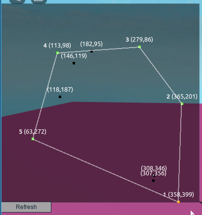
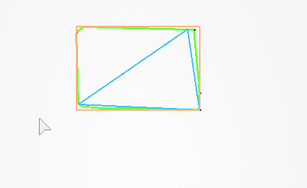

# Geo

[](https://github.com/vocksel/geo/actions/workflows/ci.yml)

A library for analyzing 2D points to determine the geometric shape they represent.


## Usage

```lua
local points = { Vector2.new(x1, y1), Vector2.new(x2, y2), Vector2.new(x3, y3), ... }

if Geo.detectShape(points) == Geo.Shape.Line then
    print("The points represent a line")

    local orientation = Geo.detectOrientation(points)

    if orientation == Geo.Orientation.North then
        print("The line is pointing up")
    end
end
```

## Installation

### Wally

If you are using [Wally](https://github.com/UpliftGames/wally), add the following to your `wally.toml` and run `wally install` to get a copy of the package.

```
[dependencies]
Geo = "vocksel/geo@v1.0.1
```

### Model File

* Download a copy of the rbxm from the [releases page](https://github.com/vocksel/geo/releases/latest) under the Assets section. 
* Drag and drop the file into Roblox Studio to add it to your experience.

## API

### `detectShape(points: Array<Vector2>): Shape`

Given an ordered list of points, this function determines the best possible shape that the points represent. Returns a Shape enum that you can use for comparison with `Geo.Shape`

Since Geo is a library for analyzing drawn shapes, the points should be in order of when they were drawn for best results.

```lua
local points = { Vector2.new(x1, y1), Vector2.new(x2, y2), Vector2.new(x3, y3), ... }

if detectShape(points) == Geo.Shape.Line then
    print("The hull represents a line")
end
```

This function makes a distinction between squares and rectangles. If you do not care which one you get, a conditional that includes both cases is your best course of action.

### `detectOrientation(points: Array<Vector2>): Orientation`

Gets the closest cardinal direction that the given points are facing in. Returns nil if an orientation cannot be detected.

This function only works for points that make a Line or Chevron shape since circles and rectangles have no discernable facing direction. Triangles are the only shape that may be supported later.

```lua
local points = { Vector2.new(x1, y1), Vector2.new(x2, y2), Vector2.new(x3, y3), ... }

local orientation = detectOrientation(points)

if orientation == Geo.Orientation.North then
    print("The shape is facing up")
elseif orientation == Geo.Orientation.West then
    print("The shape is facing left")
end
```

### `Shape`

This is an enum representing one of the shapes that `detectShape()` returns. It has the following items:

- Line
- Circle
- Triangle
- Square
- Rectangle
- Chevron

### `Orientation`

This is an enum that represents the 8 possible cardinal directions. It has the following items:

- North
- NorthEast
- East
- SouthEast
- South
- SouthWest
- West
- NorthWest

## Helpers

The above functions are the core of this library. However, since there are a lot of useful helper functions that are critical to getting to the point of shape recognition, they are exposed as well for all to make use of.

### `getBoundingBox(points: Array<Vector2>): Array<Vector2>`

Returns an array of 4 points that represent the enclosing rectangle (minimum bounding box) around `points`.

The following image illustrates how this works. From a convex hull, the enclosing rectangle surrounds the hull entirely.


### `getConvexHull(points: Array<Vector2>): Array<Vector2>`

Uses an implementation of the Graham Scan algorithm to find the points that represent the convex hull from a list of ordered points.

The points passed to this function must pass through `sortCounterClockwise()` first, otherwise you will get unexpected results.

This gif shows an example of how this works. Notice that only the outer points are connected, and that the bottommost point is highlighted a different color.



### `getCornerIndices(points: Array<Vector2>, maxAngle=100, minAngle=10): Array<int>`

Gets an approximation of the number of corners a shape has.

```
local points = { Vector2.new(), Vector2.new(), ... }
local indices = getCornerIndices(points)
```

Returns an array of the indices where a corner exists in the points array. The reason the indices are returned rather than the Vector2 itself is so its easy to traverse relative to the corners. For example, if you have a corner at index 10, then you can consider the points from 1-9 to be a line.

### `getLargestTriangle(points: Array<Vector2>): Array<Vector2>`

Given an ordered list of Vector2s, this function will calculate the 3 points that make up the maximum-area triangle incribed within the full list.



### `getPerimeter(points: Array<Vector2>): number`

Given an ordered list of points, this function counts up the distance between every side length to get the perimeter of the geometric object.


### `getPolygonArea(points: Array<Vector2>): number`

Gets the area of an arbitrary polygon. Works best when given a hull sorted in counterclockwise order.

```lua
local sorted = ...
local hull = getConvexHull(sorted)
local area = getPolygonArea(hull)
```

### `getSideLengths(points: Array<Vector2>): Vector2`

Given a rectangle, returns the side lengths as a Vector2 where X is the width and Y is the height.

For this to work, the points of the rectangle must be aligned relatively to each other. For example, the points that represent the width must be on the same Y axis and the points that represent the height must be on the same X axis.

It is best to use this function in conjunction with `getBoundingBox()`.

### `getTriangleArea(p1: Vector2, p2: Vector2, p3: Vector2): number`

Calculates the are of a triangle from any three points.

```lua
local area = getTriangleArea(Vector2.new(), Vector2.new(), Vector2.new())
```

### `isLine(points: Array<Vector2>): boolean`

Checks if a series of drawn points represent a Line shape by calculating the thinness of the points given.

### `isChevron(points: Array<Vector2>): boolean`

Checks if a series of drawn points represent a Chevron shape by calculating the sharp corners and where the points start and end.

### `sortCounterClockwise(points: Array<Vector2>): Array<Vector2>`

Sorts `points` in counterclockwise order, returning the newly sorted array.

```lua
local points = { Vector2.new(x1, y1), Vector2.new(x2, y2), Vector2.new(x3, y3), ... }
local sorted = sortCounterClockwise(points)
```

This is crucial for `getConvexHull()` which relies on counterclockwise order for calculating the hull.

The bottommost point is selected as an anchor and every other point is sorted by its angle relative to the anchor. The anchor is therefore the first point in the resulting list, and every consecutive point has a counterclockwise angle to the anchor that is bigger than the last.

## Credits

This would not have been possible without the following papers:

[A Simple Approach to Recognise Geometric Shapes Interactively](https://www.academia.edu/580171/A_Simple_Approach_to_Recognise_Geometric_Shapes_Interactively)

This paper was invaluable in forming a basis for how to tackle shape recognition. In summary, they calculate the convex hull from a series of vertices, compare approximate equality with geoemtric ratios, and use a decision tree to move between checking each type of shape based on the certainty of the ratio.

[Maximum-Area Triangle in a Convex Polygon, Revisited](https://www.sciencedirect.com/science/article/abs/pii/S0020019020300302)

Algorithm 2 outlined in this paper was used as the basis for finding the maximum-area triangle inscribed within the convex hull. After many false starts and several days of researching, we now have a functional implementation.

## License

MIT
